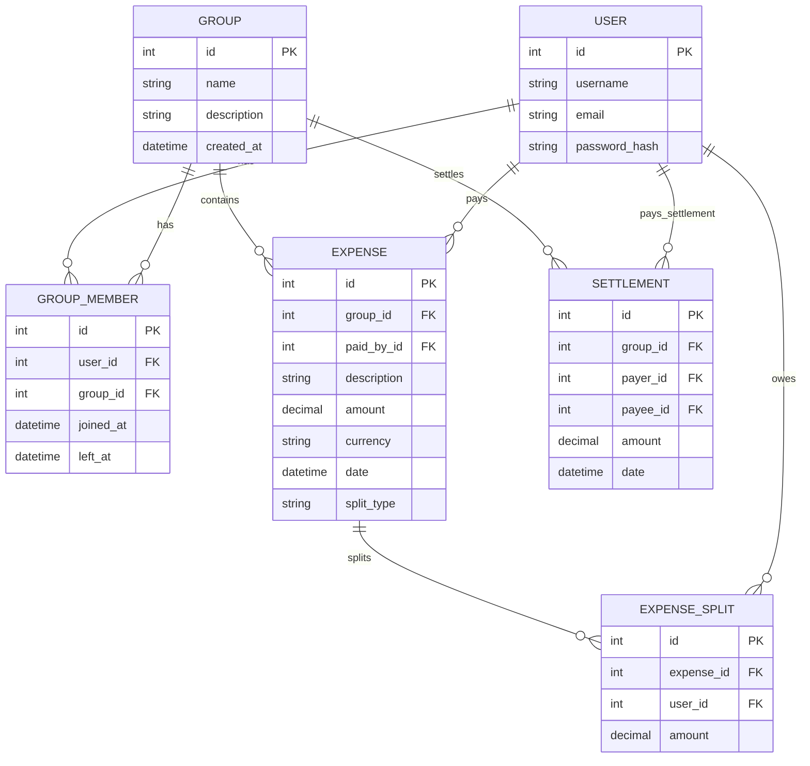

# SCOPE.md

## Anomaly Log

Below is the list of 18 data anomalies systematically detected and handled by the SplitSmart importer pipeline:

### 1. Duplicate Entries
- **Problem**: Dev logged Dinner at Marina Bites twice on `08-02-2026` (Rows 5 and 6) for ₹3,200.
- **Policy**: Uniqueness hash generated based on date, description tokens, amount, and payer. Propose skipping Row 6. Default checkbox to unchecked for user approval.

### 2. Conflicting Duplicates (Different Amount/Payer)
- **Problem**: Dinner at Thalassa logged by Aisha for ₹2,400 (Row 24) and Rohan for ₹2,450 (Row 25) on `11-03-2026`.
- **Policy**: Detected as conflicting descriptions and dates. Based on Rohan's note ("Aisha's is wrong"), the system defaults to keeping Rohan's ₹2,450 row and skipping Aisha's ₹2,400 row (unchecked by default), allowing manual review.

### 3. Inconsistent Number Formatting
- **Problem**: Electricity Feb amount logged as `"1,200"` (Row 7) with quotes and commas.
- **Policy**: Cleaned of string markers, quotes, and commas, converting to Python `Decimal`.

### 4. Character Casing in Names
- **Problem**: Priya logged as `priya` (Row 9) and Rohan logged as `rohan ` (Row 27).
- **Policy**: Normalized to capital casing (`Priya`, `Rohan`) and stripped of trailing whitespace.

### 5. Over-Precision in Amount
- **Problem**: Cylinder refill logged as `899.995` (Row 10).
- **Policy**: Quantized to 2 decimal places using `ROUND_HALF_UP` -> `900.00`.

### 6. Nicknames / User Mappings
- **Problem**: Priya logged as `Priya S` (Row 11).
- **Policy**: Name mapped to user `Priya` to prevent creating duplicate user accounts.

### 7. Missing Payer Field
- **Problem**: House cleaning supplies (Row 13) has an empty payer (`paid_by`) field.
- **Policy**: Flashed warning and proposed defaulting payer to `Aisha` (group admin).

### 8. Settlements Logged as Expenses (Rohan)
- **Problem**: Row 14 description: "Rohan paid Aisha back", amount ₹5,000, split_type empty, split_with Aisha.
- **Policy**: Identified via keyword and split count as a Settlement. Imported as a `Settlement` record, bypassing `Expense` double-entry splits.

### 9. Percentage Sum Mismatch
- **Problem**: Pizza Friday (Row 15) and Weekend Brunch (Row 32) percentage splits sum to 110%.
- **Policy**: Normalized percentages proportionally to sum to exactly 100% before calculating split shares.

### 10. Multi-Currency Spends (USD)
- **Problem**: Goa villa booking ($540), Beach shack lunch ($84), Parasailing ($150) logged in USD.
- **Policy**: Converted to INR using a user-inputted rate (default `1 USD = 83 INR`). Converted amount stored, and original currency conversion trace appended to description.

### 11. Guest Splitting (Non-member Kabir)
- **Problem**: Dev's friend Kabir (Row 23) in splits, but Kabir is not a flatmate.
- **Policy**: Kabir created as a guest member of the group, and his debt is tracked.

### 12. Negative Refund Amounts
- **Problem**: Parasailing refund of -$30 USD (Row 26).
- **Policy**: Stored as negative splits, which correctly subtracts from the net debt of group members.

### 13. Shortened Date Formats
- **Problem**: Airport cab date logged as `Mar-14` (Row 27).
- **Policy**: Parsed using format `%b-%d` and defaulted the year to `2026` based on surrounding chronological sequence.

### 14. Missing Currency field
- **Problem**: Groceries DMart (Row 28) has an empty currency column.
- **Policy**: Defaulted to `INR`.

### 15. Zero-Value Expenses
- **Problem**: Dinner order Swiggy logged with `0` amount (Row 31).
- **Policy**: Imported as a zero-value expense and split equally to maintain historical logs.

### 16. Ambiguous Out-of-Order Dates
- **Problem**: Deep cleaning service date is `04-05-2026` (Row 34). Notes say: "is this April 5 or May 4?".
- **Policy**: Since it falls chronologically between March 28 and April 1, the system parses it as `05-04-2026` (April 5th) rather than May 4th.

### 17. Ex-Residency Timeline Conflict
- **Problem**: Meera moved out March 31, but is in the split list for groceries on April 2 (Row 36).
- **Policy**: System excludes Meera from the splits on expenses dated after her departure date (`left_at = 2026-03-31`), distributing shares equally among active members.

### 18. New Residency Timeline Conflict / Settlement
- **Problem**: Sam moved in mid-April. Row 38 is "Sam deposit share" to Aisha, which is a settlement.
- **Policy**: Sam's group membership starts `2026-04-08`. Sam is excluded from any historical splits prior to his join date (e.g. March electricity). Deposit is recorded as a direct Settlement to Aisha.

---

## Database Schema

